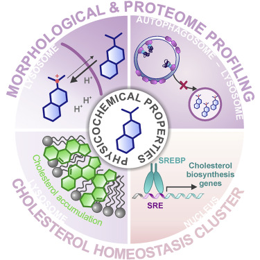

# Recent Publications and Talks

## Recent Publications

## Illuminating Dark Chemical Matter Using the Cell Painting Assay. 
Pahl, A.; Liu, J.; Patil, S.; Rezaei Adariani, S.; Schölermann, B.; Warmers, J.; Bonowski, J.; Koska, S.; Akbulut, Y.; Seitz, C.; Sievers, S.; Ziegler, S.; Waldmann, H.  
*J. Med. Chem. 2024.* [DOI](https://doi.org/10.1021/acs.jmedchem.4c00160)  
  

Abstract

Screening for small-molecule modulators of disease-relevant targets and phenotypes is the first step on the way to new drugs. Large compound libraries have been synthesized by academia and, particularly, pharmaceutical companies to meet the need for novel chemical entities that are as diverse as possible. Screening of these compound libraries revealed a portion of small molecules that is inactive in more than 100 different assays and was therefore termed “dark chemical matter” (DCM). Deorphanization of DCM promises to yield very selective compounds as they are expected to have less off-target effects. We employed morphological profiling using the Cell Painting assay to detect bioactive DCM. Within the DCM collection, we identified bioactive compounds and confirmed several modulators of microtubules, DNA synthesis, and pyrimidine biosynthesis. Profiling approaches are, therefore, powerful tools to probe compound collections for bioactivity in an unbiased manner and are particularly suitable for deorphanization of DCM.

### Assessing Biologic/Toxicologic Effects of Extractables from Plastic Contact Materials for Advanced Therapy Manufacturing Using Cell Painting Assay and Cytotoxicity Screening.
Pahl, I.; Pahl, A.; Hauk, A.; Budde, D.; Sievers, S.; Fruth, L.; Menzel, R.  
*Sci. Rep. 2024, 14 (1), 5933.* [DOI](https://doi.org/10.1038/s41598-024-55952-3)  

Abstract

Plastic components are essential in the pharmaceutical industry, encompassing container closure systems, laboratory handling equipment, and single-use systems. As part of their material qualification process, studies on interactions between plastic contact materials and process solutions or drug products are conducted. The assessment of single-use systems includes their potential impact on patient safety, product quality, and process performance. This is particularly crucial in cell and gene therapy applications since interactions with the plastic contact material may result in an adverse effect on the isolated therapeutic human cells. We utilized the cell painting assay (CPA), a non-targeted method, for profiling the morphological characteristics of U2OS human osteosarcoma cells in contact with chemicals related to plastic contact materials. Specifically, we conducted a comprehensive analysis of 45 common plastic extractables, and two extracts from single-use systems. Results of the CPA are compared with a standard cytotoxicity assay, an osteogenesis differentiation assay, and in silico toxicity predictions. The findings of this feasibility study demonstrate that the device extracts and most of the tested compounds do not evoke any measurable biological changes on the cells (induction  ≤ 5%) among the 579 cell features measured at concentrations  ≤ 50 µM. CPA can serve as an important assay to reveal unique information not accessible through quantitative structure–activity relationship analysis and vice versa. The results highlight the need for a combination of in vitro and in silico methods in a comprehensive assessment of single-use equipment utilized in advanced therapy medicinal products manufacturing.

### Discovery of a Novel Pseudo-Natural Product Aurora Kinase Inhibitor Chemotype through Morphological Profiling.
Wang, L.; Yilmaz, F.; Yildirim, O.; Schölermann, B.; Bag, S.; Greiner, L.; Pahl, A.; Sievers, S.; Scheel, R.; Strohmann, C.; Squire, C.; Foley, D. J.; Ziegler, S.; Grigalunas, M.; Waldmann, H.  
*Advanced Science 2024, 2309202.* [DOI](https://doi.org/10.1002/advs.202309202)  
  

Abstract

The pseudo-natural product (pseudo-NP) concept aims to combine NP fragments in arrangements that are not accessible through known biosynthetic pathways. The resulting compounds retain the biological relevance of NPs but are not yet linked to bioactivities and may therefore be best evaluated by unbiased screening methods resulting in the identification of unexpected or unprecedented bioactivities. Herein, various NP fragments are combined with a tricyclic core connectivity via interrupted Fischer indole and indole dearomatization reactions to provide a collection of highly three-dimensional pseudo-NPs. Target hypothesis generation by morphological profiling via the cell painting assay guides the identification of an unprecedented chemotype for Aurora kinase inhibition with both its relatively highly 3D structure and its physicochemical properties being very different from known inhibitors. Biochemical and cell biological characterization indicate that the phenotype identified by the cell painting assay corresponds to the inhibition of Aurora kinase B.

### A Divergent Intermediate Strategy Yields Biologically Diverse Pseudo-Natural Products.
Bag, S.; Liu, J.; Patil, S.; Bonowski, J.; Koska, S.; Schölermann, B.; Zhang, R.; Wang, L.; Pahl, A.; Sievers, S.; Brieger, L.; Strohmann, C.; Ziegler, S.; Grigalunas, M.; Waldmann, H.  
*Nat. Chem. 2024, 1-14.* [DOI](https://doi.org/10.1038/s41557-024-01458-4)  
  

Abstract

The efficient exploration of biologically relevant chemical space is essential for the discovery of bioactive compounds. A molecular design principle that possesses both biological relevance and structural diversity may more efficiently lead to compound collections that are enriched in diverse bioactivities. Here the diverse pseudo-natural product (PNP) strategy, which combines the biological relevance of the PNP concept with synthetic diversification strategies from diversity-oriented synthesis, is reported. A diverse PNP collection was synthesized from a common divergent intermediate through developed indole dearomatization methodologies to afford three-dimensional molecular frameworks that could be further diversified via intramolecular coupling and/or carbon monoxide insertion. In total, 154 PNPs were synthesized representing eight different classes. Cheminformatic analyses showed that the PNPs are structurally diverse between classes. Biological investigations revealed the extent of diverse bioactivity enrichment of the collection in which four inhibitors of Hedgehog signalling, DNA synthesis, de novo pyrimidine biosynthesis and tubulin polymerization were identified from four different PNP classes.

### Synthetic Matching of Complex Monoterpene Indole Alkaloid Chemical Space.
Xie, J.; Pahl, A.; Krzyzanowski, A.; Krupp, A.; Liu, J.; Koska, S.; Schölermann, B.; Zhang, R.; Bonowski, J.; Sievers, S.; Strohmann, C.; Ziegler, S.; Grigalunas, M.; Waldmann, H.  
*Angew. Chem. Int. Ed. 2023, 62 (48), e202310222* [DOI](https://doi.org/10.1002/anie.202310222)  
  

Abstract

Monoterpene indole alkaloids (MIAs) are endowed with high structural and spatial complexity and characterized by diverse biological activities. Given this complexity-activity combination in MIAs, rapid and efficient access to chemical matter related to and with complexity similar to these alkaloids would be highly desirable, since such compound classes might display novel bioactivity. We describe the design and synthesis of a pseudo-natural product (pseudo-NP) collection obtained by the unprecedented combination of MIA fragments through complexity-generating transformations, resulting in arrangements not currently accessible by biosynthetic pathways. Cheminformatic analyses revealed that both the pseudo-NPs and the MIAs reside in a unique and common area of chemical space with high spatial complexity-density that is only sparsely populated by other natural products and drugs. Investigation of bioactivity guided by morphological profiling identified pseudo-NPs that inhibit DNA synthesis and modulate tubulin. These results demonstrate that the pseudo-NP collection occupies similar biologically relevant chemical space that Nature has endowed MIAs with.

### Morphological Subprofile Analysis for Bioactivity Annotation of Small Molecules.
Pahl, A.; Schölermann, B.; Lampe, P.; Rusch, M.; Dow, M.;  Hedberg, C.; Nelson, A.; Sievers, S.; Waldmann, H.; Ziegler, S.  
*Cell Chemical Biology 2023, 30 (7), 839-853.e7* [DOI](https://doi.org/10.1016/j.chembiol.2023.06.003)  
  

Abstract

Fast prediction of the mode of action (MoA) for bioactive compounds would immensely foster bioactivity annotation in compound collections and may early on reveal off-targets in chemical biology research and drug discovery. Morphological profiling, e.g., using the Cell Painting assay, offers a fast, unbiased assessment of compound activity on various targets in one experiment. However, due to incomplete bioactivity annotation and unknown activities of reference compounds, prediction of bioactivity is not straightforward. Here we introduce the concept of subprofile analysis to map the MoA for both, reference and unexplored compounds. We defined MoA clusters and extracted cluster subprofiles that contain only a subset of morphological features. Subprofile analysis allows for the assignment of compounds to, currently, twelve targets or MoA. This approach enables rapid bioactivity annotation of compounds and will be extended to further clusters in the future.

### Illuminating Dark Chemical Matter using the Cell Painting Assay
Pahl, A.; Liu, J.; Patil, S.; Adariani, S.R.; Schölermann, B.; Warmers, J.; Bonowski, J.; Koska, S.; Sievers, S.; Ziegler, S.; Waldmann, H.  
*Preprint on bioRxiv, submitted to J. Med. Chem.* [DOI](https://doi.org/10.1101/2023.05.31.542818)  

Abstract

The identification of bioactive small molecules is at the heart of chemical biology and medicinal research. The screening for modulators of disease-relevant targets and phenotypes is the first step on the way to new drugs. Therefore, large compound libraries have been synthesized and employed by academia and, particularly, pharmaceutical companies to meet the need for chemical entities that are as diverse as possible. Extensive screening of these compound libraries revealed a portion of small molecules that is inactive in more than 100 different assays and was therefore termed ‘dark chemical matter’ (DCM). Deorphanization of DCM promises to yield very selective compounds as they, by definition, should have less off-target effects. We employed morphological profiling using the Cell painting assay (CPA) to detect bioactive DCM compounds. CPA is not biased to a given target or phenotype and can detect various unrelated mechanisms and modes of action. Within the DCM collection, we identified bioactive compounds and confirmed several modulators of microtubules, DNA synthesis and pyrimidine biosynthesis. Profiling approaches are therefore powerful tools to probe compound collections for bioactivity in an unbiased manner and particularly suitable for deorphanization of DCM.

### Spacial Score – A Comprehensive Topological Indicator for Small Molecule Complexity
Krzyzanowski, A.; Pahl, A.; Grigalunas, M.; Waldmann, H.  
*J. Med. Chem. 2023, 66 (18), 12739–12750* [DOI](https://doi.org/10.1021/acs.jmedchem.3c00689)  
  

Abstract

The fraction of sp3-hybridized carbons (Fsp3) and the fraction of stereogenic carbons (FCstereo) are two widely employed scores of molecular complexity with strong links to biologically relevant features. However, they do not comprehensively express molecular topology, and they often do not match the chemical intuition of complexity. We propose the spacial score (SPS) as an empirical scoring system that builds upon the principle underlying Fsp3 and FCstereo and expresses the spacial complexity of a compound in a uniform manner on a highly granular scale. The size-normalized SPS (nSPS) can differentiate distributions of natural products and synthetic compounds and is applicable in the analysis of biological activity data. Analysis of the ChEMBL database revealed general trends of increasing selectivity and potency with increasing nSPS. SPS can also be used advantageously in planning and analysis of synthesis programs for direct comparison of chemical transformations and intermediates in reaction sequences.

### Phenotypic Profiling Enables the Targeted Design of a Novel Pseudo-Natural Product Class.
Zinken, S.; Pahl, A.; Grigalunas, M.; Waldmann, H.  
*Tetrahedron 2023, 133553* [DOI](https://doi.org/10.1016/j.tet.2023.133553)  
  

Abstract

Chromaline pseudo-natural products are the combination of chromane and 4H-quinoline natural product fragments and were designed to access novel biological space based on the diverse bioactivity profiles of previous pseudo-natural product classes composed of similar fragments. The development and application of a four-step synthetic sequence followed by derivatization afforded a collection of 39 chromalines that is topologically diverse and possesses both drug-like and natural product-like properties. Morphological profiling via the cell painting assay revealed the chromalines have bioactivity profiles that are distinct from the guiding pseudo-natural product collections and suggests that the new fragment combination may have led to a unique bioactivity.

### Morphological Profiling Identifies the Motor Protein Eg5 as Cellular Target of Spirooxindoles.
Liu, J.; Mallick, S.; Xie, Y.; Grassin, C.; Lucas, B.; Schölermann, B.; Pahl, A.; Scheel, R.; Strohmann, C.; Protzel, C.; Berg, T.; Merten, C.; Ziegler, S.; Waldmann, H.  
*Angew. Chem. Int. Ed. 2023, 62 (21), e202301955* [DOI](https://doi.org/10.1002/anie.202301955)  
  

Abstract

Oxindoles and iso-oxindoles are natural product-derived scaffolds that provide inspiration for the design and synthesis of novel biologically relevant compound classes. Notably, the spirocyclic connection of oxindoles with iso-oxindoles has not been explored by nature but promises to provide structurally related compounds endowed with novel bioactivity. Therefore, methods for their efficient synthesis and the conclusive discovery of their cellular targets are highly desirable. We describe a selective RhIII-catalyzed scaffold-divergent synthesis of spirooxindole–isooxindoles and spirooxindole–oxindoles from differently protected diazooxindoles and N-pivaloyloxy aryl amides which includes a functional group-controlled Lossen rearrangement as key step. Unbiased morphological profiling of a corresponding compound collection in the Cell Painting assay efficiently identified the mitotic kinesin Eg5 as the cellular target of the spirooxindoles, defining a unique Eg5 inhibitor chemotype.

### Scaffold Remodelling of Diazaspirotricycles Enables Synthesis of Diverse sp3-Rich Compounds With Distinct Phenotypic Effects.
Okolo, E.A.; Pahl, A.; Sievers, S.; Pask, C.M.; Nelson, A.; Marsden, S.  
*Chem. Eur. J. 2023, 29 (26), e202203992* [DOI](https://doi.org/10.1002/chem.202203992)  
  

Abstract

A 'top down' scaffold remodelling approach to library synthesis was applied to spirotricyclic ureas prepared by a complexity-generating oxidative dearomatisation. Eighteen structurally-distinct, sp3-rich scaffolds were accessed from the parent tricycle through ring addition, cleavage and expansion strategies. Biological screening of a small compound library based on these scaffolds using the cell-painting assay demonstrated distinctive phenotypic responses engendered by different library members, illustrating the functional as well as structural diversity of the compounds.

### Identification of Biologically Diverse Tetrahydronaphtalen-2-Ols through the Synthesis and Phenotypic Profiling of Chemically Diverse, Estradiol-Inspired Compounds.
Whitmarsh-Everiss, T.; Wang, Z.; Hansen, C. H.; Depta, L.; Sassetti, E.; Dan, O. R.; Pahl, A.; Sievers, S.; Laraia, L.  
*ChemBioChem, 2023, 24 (5), e202200555.* [DOI](https://doi.org/10.1002/cbic.202200555)  
  

Abstract

Combining natural product fragments to design new scaffolds with unprecedented bioactivity is a powerful strategy for the discovery of tool compounds and potential therapeutics. However, the choice of fragments to couple and the biological screens to employ remain open questions in the field. By choosing a primary fragment containing the A/B ring system of estradiol and fusing it to nine different secondary fragments, we were able to identify compounds that modulated four different phenotypes: inhibition of autophagy and osteoblast differentiation, as well as potassium channel and tubulin modulation. The latter two were uncovered by using unbiased morphological profiling with a cell-painting assay. The number of hits and variety in bioactivity discovered validates the use of recombining natural product fragments coupled to phenotypic screening for the rapid identification of biologically diverse compounds.

### Identification of Dihydroorotate Dehydrogenase Inhibitors Using the Cell Painting Assay.
Schölermann, B.; Bonowski, J.; Grigalunas, M.; Burhop, A.; Xie, Y.; Hoock, J. G. F.; Liu, J.; Dow, M.; Nelson, A.; Nowak, C.; Pahl, A.; Sievers, S.; Ziegler, S.  
*ChemBioChem, 2022, 23 (22), e202200475.* [DOI](https://doi.org/10.1002/cbic.202200475)  
  

Abstract

Profiling approaches have been increasingly employed for the characterization of disease-relevant phenotypes or compound perturbation as they provide a broad, unbiased view on impaired cellular states. We report that morphological profiling using the cell painting assay (CPA) can detect modulators of de novo pyrimidine biosynthesis and of dihydroorotate dehydrogenase (DHODH) in particular. The CPA can differentiate between impairment of pyrimidine and folate metabolism, which both affect cellular nucleotide pools. The identified morphological signature is shared by inhibitors of DHODH and the functionally tightly coupled complex III of the mitochondrial respiratory chain as well as by UMP synthase, which is downstream of DHODH. The CPA appears to be particularly suited for the detection of DHODH inhibitors at the site of their action in cells. As DHODH is a validated therapeutic target, the CPA will enable unbiased identification of DHODH inhibitors and inhibitors of de novo pyrimidine biosynthesis for biological research and drug discovery.

### Unprecedented Combination of Polyketide Natural Product Fragments Identifies the New Hedgehog Signaling Pathway Inhibitor Grismonone.
Grigalunas, M.; Patil, S.; Krzyzanowski, A.; Pahl, A.; Flegel, J.; Schölermann, B.; Xie, J.; Sievers, S.; Ziegler, S.; Waldmann, H.  
*Chemistry – A European Journal 2022, 28 (67), e202202164.*  [DOI](https://doi.org/10.1002/chem.202202164)  
  

Abstract

Pseudo-natural products (pseudo-NPs) are de novo combinations of natural product (NP) fragments that define novel bioactive chemotypes. For their discovery, new design principles are being sought. Previously, pseudo-NPs were synthesized by the combination of fragments originating from biosynthetically unrelated NPs to guarantee structural novelty and novel bioactivity. We report the combination of fragments from biosynthetically related NPs in novel arrangements to yield a novel chemotype with activity not shared by the guiding fragments. We describe the synthesis of the polyketide pseudo-NP grismonone and identify it as a structurally novel and potent inhibitor of Hedgehog signaling. The insight that the de novo combination of fragments derived from biosynthetically related NPs may also yield new biologically relevant compound classes with unexpected bioactivity may be considered a chemical extension or diversion of existing biosynthetic pathways and greatly expands the opportunities for exploration of biologically relevant chemical space by means of the pseudo-NP principle.

### Morphological Profiling by Means of the Cell Painting Assay Enables Identification of Tubulin-Targeting Compounds.
Akbarzadeh, M.; Deipenwisch, I.; Schoelermann, B.; Pahl, A.; Sievers, S.; Ziegler, S.; Waldmann, H.  
*Cell Chemical Biology 2022, 29 (6), 1053.*  [DOI](https://doi.org/10.1016/j.chembiol.2021.12.009)  
  

Abstract

In phenotypic compound discovery, conclusive identification of cellular targets and mode of action are often impaired by off-target binding. In particular, microtubules are frequently targeted in cellular assays. However, in vitro tubulin binding assays do not correctly reflect the cellular context, and conclusive high-throughput phenotypic assays monitoring tubulin binding are scarce, such that tubulin binding is rarely identified. We report that morphological profiling using the Cell Painting assay (CPA) can efficiently detect tubulin modulators in compound collections with a high throughput, including annotated reference compounds and unannotated compound classes with unrelated chemotypes and scaffolds. Small-molecule tubulin binders share similar CPA fingerprints, which enables prediction and experimental validation of microtubule-binding activity. Our findings suggest that CPA or a related morphological profiling approach will be an invaluable addition to small-molecule discovery programs in chemical biology and medicinal chemistry, enabling early identification of one of the most frequently observed off-target activities.

### Combined Morphological and Proteome Profiling Reveals Target-Independent Impairment of Cholesterol Homeostasis.
Schneidewind, T.; Brause, A.; Schölermann, B.; Sievers, S.; Pahl, A.; Sankar, *M. G.; Winzker, M.; Janning, P.; Kumar, K.; Ziegler, S.; Waldmann, H.  
Cell Chemical Biology 2021, 28 (12), 1780-1794.e5.*  [DOI](https://doi.org/10.1016/j.chembiol.2021.06.003)  
  

Abstract

Unbiased profiling approaches are powerful tools for small-molecule target or mode-of-action deconvolution as they generate a holistic view of the bioactivity space. This is particularly important for non-protein targets that are difficult to identify with commonly applied target identification methods. Thereby, unbiased profiling can enable identification of novel bioactivity even for annotated compounds. We report the identification of a large bioactivity cluster comprised of numerous well-characterized drugs with different primary targets using a combination of the morphological Cell Painting Assay and proteome profiling. Cluster members alter cholesterol homeostasis and localization due to their physicochemical properties that lead to protonation and accumulation in lysosomes, an increase in lysosomal pH, and a disturbed cholesterol homeostasis. The identified cluster enables identification of modulators of cholesterol homeostasis and links regulation of genes or proteins involved in cholesterol synthesis or trafficking to physicochemical properties rather than to nominal targets.

### Pseudonatural Products Occur Frequently in Biologically Relevant Compounds.
Gally, J.-M.; Pahl, A.; Czodrowski, P.; Waldmann, H.  
*J. Chem. Inf. Model. 2021, 61 (11), 5458–5468.*  [DOI](https://doi.org/10.1021/acs.jcim.1c01084)  
  

Abstract

A new methodology for classifying fragment combinations and characterizing pseudonatural products (PNPs) is described. The source code is based on open-source tools and is organized as a Python package. Tasks can be executed individually or within the context of scalable, robust workflows. First, structures are standardized and duplicate entries are filtered out. Then, molecules are probed for the presence of predefined fragments. For molecules with more than one match, fragment combinations are classified. The algorithm considers the pairwise relative position of fragments within the molecule (fused atoms, linkers, intermediary rings), resulting in 18 different possible fragment combination categories. Finally, all combinations for a given molecule are assembled into a fragment combination graph, with fragments as nodes and combination types as edges. This workflow was applied to characterize PNPs in the ChEMBL database via comparison of fragment combination graphs with natural product (NP) references, represented by the Dictionary of Natural Products. The Murcko fragments extracted from 2000 structures previously described were used to define NP fragments. The results indicate that ca. 23% of the biologically relevant compounds listed in ChEMBL comply to the PNP definition and that, therefore, PNPs occur frequently among known biologically relevant small molecules. The majority (>95%) of PNPs contain two to four fragments, mainly (>95%) distributed in five different combination types. These findings may provide guidance for the design of new PNPs.

### Combination of Pseudo‐Natural Product Design and Formal Natural Product Ring Distortion Yields Stereochemically and Biologically Diverse Pseudo‐Sesquiterpenoid Alkaloids.
Liu, J.; Flegel, J.; Otte, F.; Pahl, A.; Sievers, S.; Strohmann, C.; Waldmann, H.  
*Angew. Chem. Int. Ed. 2021, 60 (39), 21384–21395.*  [DOI]h(ttps://doi.org/10.1002/anie.202106654)  
  

Abstract

We describe the synthesis and biological evaluation of a new natural product-inspired compound class obtained by combining the conceptually complementary pseudo-natural product (pseudo-NP) design strategy and a formal adaptation of the complexity-to-diversity ring distortion approach. Fragment-sized α-methylene-sesquiterpene lactones, whose scaffolds can formally be viewed as related to each other or are obtained by ring distortion, were combined with alkaloid-derived pyrrolidine fragments by means of highly selective stereocomplementary 1,3-dipolar cycloaddition reactions. The resulting pseudo-sesquiterpenoid alkaloids were found to be both chemically and biologically diverse, and their biological performance distinctly depends on both the structure of the sesquiterpene lactone-derived scaffolds and the stereochemistry of the pyrrolidine fragment. Biological investigation of the compound collection led to the discovery of a novel chemotype inhibiting Hedgehog-dependent osteoblast differentiation.

### Design, Synthesis, and Biological Evaluation of Chemically and Biologically Diverse Pyrroquinoline Pseudo Natural Products.
Liu, J.; Cremosnik, G. S.; Otte, F.; Pahl, A.; Sievers, S.; Strohmann, C.; Waldmann, H.  
*Angewandte Chemie International Edition 2021, 60 (9), 4648–4656.* [DOI](https://doi.org/10.1002/anie.202013731)  
  

Abstract

Natural product (NP) structures are a rich source of inspiration for the discovery of new biologically relevant chemical matter. In natural product inspired pseudo-NPs, NP-derived fragments are combined de novo in unprecedented arrangements. Described here is the design and synthesis of a 155-member pyrroquinoline pseudo-NP collection in which fragments characteristic of the tetrahydroquinoline and pyrrolidine NP classes are combined with eight different connectivities and regioisomeric arrangements. Cheminformatic analysis and biological evaluation of the compound collection by means of phenotyping in the morphological “cell painting” assay followed by principal component analysis revealed that the pseudo-NP classes are chemically diverse and that bioactivity patterns differ markedly, and are dependent on connectivity and regioisomeric arrangement of the fragments.

### Natural Product Fragment Combination to Performance-Diverse Pseudo-Natural Products.
Grigalunas, M.; Burhop, A.; Zinken, S.; Pahl, A.; Gally, J.-M.; Wild, N.; Mantel, Y.; Sievers, S.; Foley, D. J.; Scheel, R.; Strohmann, C.; Antonchick, A. P.; Waldmann, H.  
*Nat Commun 2021, 12 (1), 1883.*  [DOI](https://doi.org/10.1038/s41467-021-22174-4)  
  

Abstract

Natural product structure and fragment-based compound development inspire pseudo-natural product design through different combinations of a given natural product fragment set to compound classes expected to be chemically and biologically diverse. We describe the synthetic combination of the fragment-sized natural products quinine, quinidine, sinomenine, and griseofulvin with chromanone or indole-containing fragments to provide a 244-member pseudo-natural product collection. Cheminformatic analyses reveal that the resulting eight pseudo-natural product classes are chemically diverse and share both drug- and natural product-like properties. Unbiased biological evaluation by cell painting demonstrates that bioactivity of pseudo-natural products, guiding natural products, and fragments differ and that combination of different fragments dominates establishment of unique bioactivity. Identification of phenotypic fragment dominance enables design of compound classes with correctly predicted bioactivity. The results demonstrate that fusion of natural product fragments in different combinations and arrangements can provide chemically and biologically diverse pseudo-natural product classes for wider exploration of biologically relevant chemical space.

## Talks

* *AIDD Spring School - Advanced Machine Learning for Drug Discovery (May 2022)*
"Cell Painting assay, data analysis and reporting, and its application for identifying biological activity in new chemical matter" ([PDF](https://ai-dd.eu/sites/default/files/school-2/pahl_cell_painting.pdf))
* *RDKit UGM 2016:* "RDKit Tools for the Jupyter Notebook" ([PDF](https://github.com/rdkit/UGM_2016/blob/master/Presentations/Pahl_NotebookTools_Intro.pdf))
* *RDKit UGM 2015:* "An Interactive SDF Viewer" ([PDF](https://github.com/rdkit/UGM_2014/blob/master/Presentations/Pahl_SDFViewer.pdf))
